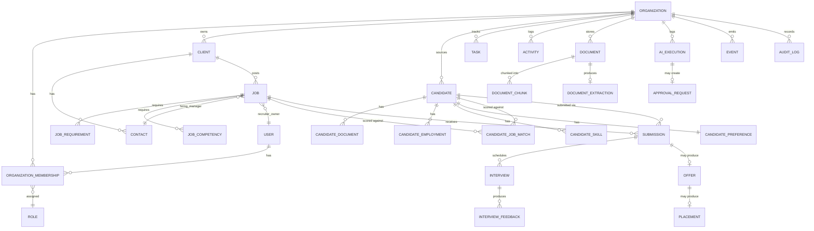

# D/E — Entity Relationship Diagram & Database Schema Proposal

All tables are PostgreSQL. All tenant-scoped tables carry `organization_id uuid not null`, indexed
first in every composite index (see [`03-security-and-tenancy.md`](./03-security-and-tenancy.md)
for why this is enforced at two layers, not one). All tables have `id uuid primary key default
gen_random_uuid()`, `created_at timestamptz not null default now()`, `updated_at timestamptz not
null default now()` unless noted.

## D. ERD — MVP core



Full-scope entities (Assignment, Timesheet, Invoice, ClientAgreement, ComplianceRequirement,
Agent/AgentRun, PlacementCheckin, Opportunity, etc.) are omitted from the diagram for readability —
listed as "Future Tables" below with their eventual foreign keys, so the MVP schema doesn't need a
breaking migration to attach them later.

## E. Schema Proposal — MVP Tables

### Identity & Tenancy

```sql
organizations
  id, name, slug (unique), status, plan_tier, created_at, updated_at

users
  id, email (unique), name, avatar_url, auth_provider_id (unique, nullable),
  created_at, updated_at
  -- users has NO organization_id: a user can belong to multiple orgs via membership

organization_memberships
  id, organization_id, user_id, role_id, status (INVITED|ACTIVE|SUSPENDED|REMOVED),
  invited_by_user_id, invited_at, joined_at
  unique (organization_id, user_id)
  index (user_id)

roles
  id, organization_id (nullable = system role), key (OWNER|ADMIN|RECRUITER|SALES|
    COORDINATOR|FINANCE|COMPLIANCE), name, is_system
  unique (organization_id, key)

permissions
  id, key (e.g. "candidate:read_pii", "job:approve", "invoice:create"), description

role_permissions
  role_id, permission_id
  primary key (role_id, permission_id)
```

### CRM

```sql
clients
  id, organization_id, name, domain, industry, employee_range, annual_revenue_range,
  headquarters, status (PROSPECT|ACTIVE|DORMANT|CHURNED), lifecycle_stage,
  account_owner_id -> users, acquisition_source, lifetime_revenue numeric(14,2) default 0,
  notes text
  index (organization_id, status)
  index (organization_id, account_owner_id)

contacts
  id, organization_id, client_id, first_name, last_name, title, email, phone,
  is_primary boolean default false, status
  index (organization_id, client_id)
```

### Recruiting — Jobs

```sql
jobs
  id, organization_id, client_id, hiring_manager_contact_id -> contacts,
  recruiter_owner_id -> users, title, normalized_title, department, job_family,
  seniority, employment_type (DIRECT_HIRE|CONTRACT|CONTRACT_TO_HIRE),
  location, workplace_type (ONSITE|HYBRID|REMOTE),
  min_compensation numeric, max_compensation numeric, currency default 'USD',
  bill_rate numeric, pay_rate numeric, fee_percentage numeric(5,2), flat_fee numeric,
  guarantee_days int, target_start_date date, priority (LOW|MEDIUM|HIGH),
  status job_status_enum, reason_for_opening, business_impact
  index (organization_id, status)
  index (organization_id, client_id)
  index (organization_id, recruiter_owner_id)
  check (fee_percentage is not null or flat_fee is not null or employment_type <> 'DIRECT_HIRE')

job_requirements
  id, organization_id, job_id, category, description, requirement_type
    (MUST_HAVE|PREFERRED|DISQUALIFIER), weight int default 1, mandatory boolean,
  evidence_required boolean default true
  index (organization_id, job_id)

job_competencies
  id, organization_id, job_id, competency, description, weight int
  index (organization_id, job_id)
```

### Recruiting — Candidates

```sql
candidates
  id, organization_id, first_name, last_name, email, phone, location,
  current_title, normalized_title, current_company, years_experience numeric,
  candidate_status candidate_status_enum, source, owner_id -> users
  index (organization_id, candidate_status)
  index (organization_id, owner_id)
  index using gin (to_tsvector('english', first_name || ' ' || last_name || ' ' ||
    coalesce(current_title,'') || ' ' || coalesce(current_company,'')))  -- full-text search

candidate_documents
  id, organization_id, candidate_id, document_id -> documents, document_type
    (RESUME|COVER_LETTER|OTHER), is_primary_resume boolean default false
  index (organization_id, candidate_id)

candidate_employments
  id, organization_id, candidate_id, company, title, normalized_title,
  start_date, end_date (nullable = current), description, source
    (EXTRACTED|USER_CONFIRMED), confidence numeric
  index (organization_id, candidate_id)

candidate_skills
  id, organization_id, candidate_id, skill_id -> skills, proficiency, years_used numeric,
  source (EXTRACTED|USER_CONFIRMED), confidence numeric
  unique (candidate_id, skill_id)

candidate_preferences
  id, organization_id, candidate_id (unique), min_compensation, max_compensation,
  currency, remote_ok boolean, travel_pct int, relocation_ok boolean,
  availability_date date, preferred_locations text[]
```

### Recruiting — Pipeline

```sql
candidate_job_matches
  id, organization_id, candidate_id, job_id, hard_filter_pass boolean,
  structured_score numeric(5,2), semantic_score numeric(5,2), composite_score numeric(5,2),
  score_breakdown jsonb,  -- see 04-ai-and-agents.md matching section for shape
  ai_explanation text, ai_execution_id -> ai_executions,
  status (SUGGESTED|REVIEWED|DISMISSED|SUBMITTED)
  unique (candidate_id, job_id)
  index (organization_id, job_id, composite_score desc)

submissions
  id, organization_id, candidate_id, job_id, candidate_job_match_id -> candidate_job_matches,
  submitted_by_user_id, status submission_status_enum,
  ai_generated_draft text, final_content text, approved_by_user_id, approved_at, sent_at
  unique (candidate_id, job_id)  -- one active submission per candidate/job
  index (organization_id, job_id, status)

interviews
  id, organization_id, submission_id, interview_type, scheduled_at, completed_at,
  interviewer_contact_id -> contacts, status (SCHEDULED|COMPLETED|CANCELLED|NO_SHOW)
  index (organization_id, submission_id)

interview_feedback
  id, organization_id, interview_id, recorded_by_user_id, source (NOTES|TRANSCRIPT|VERBAL),
  raw_notes text, structured_feedback jsonb, recommendation
    (ADVANCE|REJECT|HOLD), ai_execution_id -> ai_executions
  index (organization_id, interview_id)

offers
  id, organization_id, submission_id (unique), compensation numeric, currency,
  start_date, status (DRAFT|EXTENDED|ACCEPTED|DECLINED|RESCINDED), extended_at, decided_at
```

### Placement & Revenue

```sql
placements
  id, organization_id, offer_id (unique), candidate_id, job_id, client_id,
  placement_type (DIRECT_HIRE|CONTRACT), start_date, fee_amount numeric(14,2),
  guarantee_end_date, status (ACTIVE|GUARANTEE_PERIOD|CONFIRMED|FELL_THROUGH)
  index (organization_id, client_id)
  index (organization_id, start_date)
```

### Operations

```sql
tasks
  id, organization_id, title, description, entity_type, entity_id, assigned_to_user_id,
  due_at, priority, status (OPEN|IN_PROGRESS|DONE|CANCELLED), created_by
    (USER|SYSTEM|AGENT), source_event_id -> events
  index (organization_id, assigned_to_user_id, status)
  index (organization_id, entity_type, entity_id)

activities
  id, organization_id, entity_type, entity_id, actor_type (USER|SYSTEM|AGENT),
  actor_id, activity_type, summary, metadata jsonb
  index (organization_id, entity_type, entity_id, created_at desc)
```

### Documents

```sql
documents
  id, organization_id, uploaded_by_user_id, storage_key, filename, mime_type,
  size_bytes, document_type (RESUME|JOB_DESCRIPTION|AGREEMENT|INTAKE_NOTES|
    TRANSCRIPT|SCORECARD|OTHER), status (UPLOADED|PROCESSING|PROCESSED|FAILED)
  index (organization_id, document_type)

document_versions
  id, organization_id, document_id, version_number, storage_key, created_by
  unique (document_id, version_number)

document_chunks
  id, organization_id, document_id, chunk_index, content text, token_count
  index (organization_id, document_id)

document_extractions
  id, organization_id, document_id, extraction_type, structured_output jsonb,
  ai_execution_id -> ai_executions, reviewed_by_user_id, reviewed_at, status
    (PENDING_REVIEW|CONFIRMED|REJECTED)

document_embeddings
  id, organization_id, document_chunk_id (unique), embedding vector(1536), model
  index using ivfflat (embedding vector_cosine_ops)  -- see ADR-004
```

### AI & Governance

```sql
ai_executions
  id, organization_id, agent_slug, prompt_version, model, actor_type (USER|SYSTEM|AGENT),
  actor_id, input_context_ref jsonb, tools_called jsonb, output text,
  structured_output jsonb, input_tokens int, output_tokens int, estimated_cost_usd numeric(10,6),
  latency_ms int, status (SUCCESS|FAILED|TIMEOUT), error text,
  user_feedback (HELPFUL|NOT_HELPFUL|EDITED|ACCEPTED|REJECTED), created_at
  index (organization_id, agent_slug, created_at)
  index (organization_id, created_at)  -- for cost rollups

ai_recommendations
  id, organization_id, ai_execution_id, entity_type, entity_id, recommendation_type,
  title, body, risk_level (LOW|MEDIUM|HIGH), status (OPEN|DISMISSED|ACTED_ON), created_at

approval_requests
  id, organization_id, requested_by_agent_slug, requested_action, target_entity_type,
  target_entity_id, proposed_payload jsonb, reason, risk_level,
  status (PENDING|APPROVED|REJECTED|EXPIRED|CANCELLED|EXECUTED),
  approved_by_user_id, approved_at, rejected_at, expires_at
  index (organization_id, status)

events
  id, organization_id, event_type, entity_type, entity_id, payload jsonb,
  dispatched_at (nullable = pending outbox dispatch), created_at
  index (organization_id, dispatched_at) where dispatched_at is null  -- outbox queue

audit_logs
  id, organization_id, actor_type (USER|SYSTEM|AGENT|INTEGRATION), actor_id, action,
  entity_type, entity_id, before jsonb, after jsonb, source, ip_address, created_at
  index (organization_id, entity_type, entity_id)
  index (organization_id, created_at)
  -- INSERT-only at the DB grant level; app role has no UPDATE/DELETE on this table
```

### Knowledge ontology (minimal, MVP)

```sql
skills
  id, organization_id (nullable = global taxonomy), name, normalized_name (unique with org_id),
  category
```

`job_titles`, `industries`, `certifications` follow the same nullable-`organization_id` pattern
(global taxonomy rows shared across tenants, org-specific overrides scoped) — created when a real
consumer needs them (candidate-skill matching in Sprint 4), not speculatively in Sprint 1.

## Status enums

```sql
create type job_status_enum as enum (
  'DRAFT','INTAKE','APPROVAL','OPEN','SOURCING','INTERVIEWING','OFFER',
  'FILLED','ON_HOLD','CANCELLED','CLOSED'
);

create type candidate_status_enum as enum (
  'ACTIVE','PASSIVE','ENGAGED','SCREENING','SUBMITTED','INTERVIEWING',
  'OFFER','PLACED','ARCHIVED'
);

create type submission_status_enum as enum (
  'DRAFT','PENDING_REVIEW','APPROVED','SENT','CLIENT_REVIEW','INTERVIEW',
  'REJECTED','OFFER','PLACED','WITHDRAWN'
);
```

Postgres enums, not free-text columns — this is the deliberate trade against Section 40's warning
about ambiguous free-text statuses. The cost (a migration to add an enum value) is acceptable
because a lifecycle status changing meaning silently is worse than an `ALTER TYPE ... ADD VALUE`.

## Future Tables (named now, not built now)

Grouped by the phase that needs them (see [`05-delivery.md`](./05-delivery.md) for phase
definitions), so MVP foreign keys never have to be retrofitted:

- **Phase 6 (Placement & Revenue depth):** `assignments`, `timesheets`, `invoices`, `payments`,
  `placement_checkins`
- **Phase 2.5 / CRM depth:** `opportunities`, `client_agreements`, `client_locations`,
  `client_activities` (activities already generalized via `entity_type`/`entity_id`, so this may
  never need its own table), `client_dna` (jsonb + provenance columns per Section 8, populated only
  once enough placement history exists to derive patterns)
- **Compliance:** `compliance_requirements`, `candidate_compliance_items`
- **Agent runtime (once beyond orchestrated workflows):** `agents`, `agent_runs`
- **SLA engine:** `slas`, `sla_breaches`
- **Prompt management:** `prompt_templates`, `prompt_versions`, `agent_prompt_assignments`
- **Outcome learning:** `outcomes` (generalized entity_type/entity_id + outcome_type/reason_code,
  per Section 23 — deliberately not built until Phase 6+ because outcome capture without enough
  volume to learn from is just extra write load)
