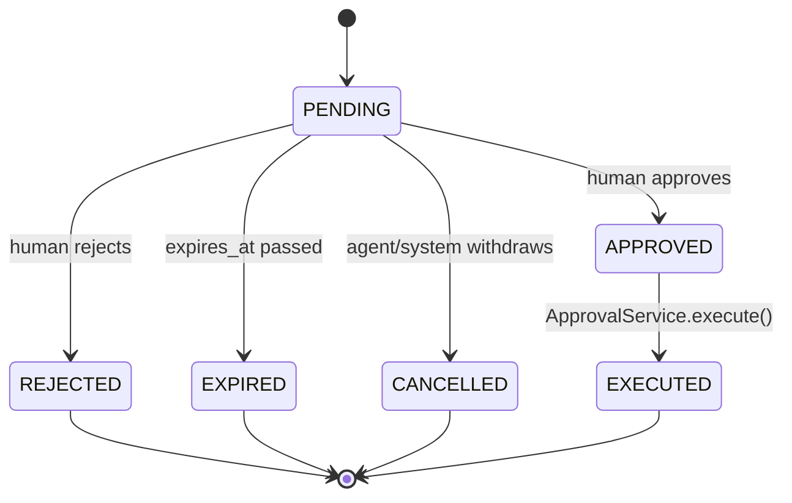

# H–P — AI Architecture, Agents, Tools, Approvals, Events, Memory, Documents, Matching, Revenue

## H. AI Architecture

### Provider abstraction

A single internal interface; Anthropic Claude and OpenAI are both adapters behind it. No workflow,
service, or route ever imports `@anthropic-ai/sdk` or `openai` directly.

```ts
interface AIProvider {
  generate(req: GenerateRequest): Promise<GenerateResult>;
  generateStructured<T>(req: GenerateRequest & { schema: ZodSchema<T> }): Promise<T>;
  embed(texts: string[]): Promise<number[][]>;
}
```

`generateStructured` is the primary call shape used by every AI workflow in this document (resume
extraction, interview feedback, submission drafts) — it validates the model's output against a Zod
schema before returning, and a schema-validation failure is a typed error the caller must handle,
not a silently-passed-through malformed object. The raw (unvalidated) response is still persisted
to `ai_executions.output` for audit even when `structured_output` validation fails, so a bad
extraction is debuggable rather than just dropped.

### Model routing

A per-task config (not scattered inline model strings) maps task → provider/model/settings, with a
fallback provider:

```ts
// server/ai/model-routing.ts
export const modelRouting: Record<AgentSlug, ModelRoute> = {
  chief_of_staff:          { provider: "anthropic", model: "claude-sonnet-5", temperature: 0.3 },
  intake_intelligence:     { provider: "anthropic", model: "claude-sonnet-5", temperature: 0.1 },
  candidate_intelligence:  { provider: "anthropic", model: "claude-haiku-4-5", temperature: 0.1 },
  interview_intelligence:  { provider: "anthropic", model: "claude-sonnet-5", temperature: 0.1 },
  submission_intelligence: { provider: "anthropic", model: "claude-sonnet-5", temperature: 0.4 },
};
```

Cheaper/faster models for high-volume extraction (resume parsing runs on every candidate upload);
stronger models reserved for reasoning-heavy tasks (Chief of Staff synthesis, submission drafting
in the client's voice). This table is the single place cost/quality tradeoffs get tuned — see cost
controls below.

### Why structured output, not free text, everywhere

Every AI workflow output that becomes a database field is defined as a Zod schema first, prompted
for second. `generateStructured` is what makes the provenance requirement (Section 2 of the vision
prompt: AI Inference is not automatically truth) mechanically enforceable — a field can't silently
end up in `candidates.current_title` without passing through a typed extraction result that also
carries `source: 'EXTRACTED'` and a `confidence` score.

## I. Agent Registry {#agent-registry}

`agents` (future table, config-as-code in MVP — see below) is a catalog entry per logical
capability, not a running process:

```ts
interface AgentDefinition {
  slug: string;                    // "candidate_intelligence"
  name: string;
  description: string;
  systemPromptVersion: string;     // -> prompt_templates (post-MVP; inline constant in MVP)
  allowedTools: ToolName[];
  allowedDataScopes: DataScope[];  // e.g. ["candidate:read", "candidate:write:draft_profile"]
  permissionLevel: PermissionLevel;
  requiresApproval: boolean;
}
```

**MVP ships 5 agent definitions**, not the 18 from the vision prompt's full registry (Section 14).
The registry's *shape* supports all 18 — adding #6 is a new config entry + workflow function, not a
schema change:

| Slug | Maps to master-prompt capability | Permission level |
|---|---|---|
| `chief_of_staff` | Chief of Staff | `READ` + `ANALYZE` only — pure aggregation, no proposals of its own (delegates to the others) |
| `intake_intelligence` | Client Intake | `DRAFT` — proposes structured `JobRequirement` rows for review |
| `candidate_intelligence` | Resume Intelligence | `DRAFT` — proposes `Candidate`/`CandidateEmployment`/`CandidateSkill` rows |
| `interview_intelligence` | Interview Intelligence | `DRAFT` — proposes `InterviewFeedback` |
| `submission_intelligence` | Submission | `PROPOSE` — creates an `ApprovalRequest` for the submission, never sends it |

In MVP, `agents` is a TypeScript config module (`server/agents/registry.ts`), not a DB table —
there's no product need yet for a recruiter to configure agent behavior at runtime, and a fake
"admin UI to edit agents" would be exactly the premature complexity Section 1 warns against. The
table is designed (Future Tables list) for when per-org agent configuration (disable an agent,
swap its model) becomes a real request — tracked as ties into feature flags (Section 52).

## J. Tool Architecture

Agents act only through typed, server-side tools — never raw DB or HTTP access. Every tool has the
same shape:

```ts
interface Tool<Input, Output> {
  name: string;
  inputSchema: ZodSchema<Input>;
  execute(ctx: ToolContext, input: Input): Promise<Output>;
}

interface ToolContext {
  organizationId: string;
  actorType: "AGENT";
  actorId: string;          // agent slug
  agentPermissionLevel: PermissionLevel;
}
```

`execute` validates `input` against the schema, checks `ctx.agentPermissionLevel` against what the
tool requires, calls the relevant **domain service** (never the ORM directly — this is the same
rule from the layering diagram in [`01-product-architecture.md`](./01-product-architecture.md)),
and logs to `ai_executions.tools_called`. MVP tool catalog, scoped to what the 5 agents actually
need:

`search_candidates`, `read_candidate`, `search_jobs`, `read_job`, `read_client`,
`retrieve_candidate_history`, `retrieve_client_history`, `search_knowledge` (document chunk
retrieval), `create_task`, `draft_submission`, `calculate_job_expected_value`,
`request_approval`, `create_recommendation`.

Every tool that would change state beyond a draft/proposal (`draft_submission`,
anything touching `submissions`, `offers`, `placements`) does not itself write the row — it calls
`request_approval`, which creates an `ApprovalRequest`. The tool layer has no code path to bypass
the approval engine; there is no "trusted agent" flag that skips it in MVP.

## K. Human Approval Engine

Reusable service, not per-agent logic:

```
Agent workflow proposes action
        ↓
ApprovalService.request({ requestedByAgent, action, targetEntity, payload, reason, riskLevel })
        ↓
ApprovalRequest[status=PENDING] written + ai_recommendations row (surfaces in Command Center)
        ↓
Human reviews in Approval Queue UI → Approve (as-is or edited) / Reject
        ↓
On approve: ApprovalService.execute() calls the underlying domain service
            (e.g. SubmissionService.send()) — the SAME method a human-initiated
            action would call
        ↓
approval_requests.status = EXECUTED, audit_logs row written
```



MVP risk tiers requiring approval, per Section 16: candidate submission, interview outcome
recommendation with material AI influence, offer-adjacent actions (none in MVP — no offer creation
tool exists yet), anything touching compensation. `LIMITED_AUTONOMOUS_EXECUTION` (create an internal
reminder, mark a deterministic-evidence task done) is designed for but has zero tools using it in
MVP — every MVP tool that changes anything is at minimum `PROPOSE`.

## L. Event Architecture

Transactional outbox, not a message broker. A domain service that changes state writes its `events`
row in the **same database transaction** as the state change:

```ts
await db.transaction(async (tx) => {
  await tx.update(jobs).set({ status: "OPEN" }).where(...);
  await tx.insert(events).values({ organizationId, eventType: "job.status_changed", ... });
});
```

A lightweight dispatcher (polling `events where dispatched_at is null`, or Postgres `LISTEN/NOTIFY`
for lower latency — implementation detail, not an architectural commitment) hands undispatched
events to Inngest functions (see ADR-009), which run the actual downstream work: trigger an AI
workflow, create a task, send a notification. This gets at-least-once delivery without Kafka,
because the write-event-with-the-change step can't be "forgotten" the way a fire-and-forget
`emit()` call could — if the transaction commits, the event row exists, even if the dispatcher is
down when it happens.

MVP event set (subset of Section 18's full list, scoped to what MVP workflows produce/consume):

`candidate.created`, `candidate.resume_uploaded`, `candidate.profile_enriched`,
`candidate.profile_confirmed`, `job.created`, `job.status_changed`, `submission.created`,
`submission.approved`, `submission.sent`, `interview.completed`, `interview.feedback_received`,
`placement.created`.

## M. Memory Architecture

Six named memory types, each mapped to a concrete storage mechanism — no undifferentiated "agent
memory":

| Memory type | What it is | Storage |
|---|---|---|
| Working | Current request/workflow-run context | In-process object, not persisted |
| Entity | Persistent facts about Client/Job/Candidate | Normal relational rows |
| Knowledge | Manuals, policies, historical documents | `document_chunks` + `document_embeddings`, retrieved via RAG |
| Outcome | Historical results | `outcomes` table (Future — Phase 6, needs volume first) |
| Preference | Explicit org/user config | `organization_settings` / user settings (Future — Phase 6) |
| Derived Intelligence | Calculated/AI-generated insights (e.g. Client DNA) | `*_dna` / `*_intelligence` tables carrying `{value, confidence, source, source_record_id, generated_at, confirmed_by_user_id, expires_at}` |

RAG retrieval is scoped by `organization_id` (RLS-covered, see
[`03-security-and-tenancy.md`](./03-security-and-tenancy.md)) plus task/entity — a Candidate
Intelligence workflow retrieves that candidate's own documents, not the whole org's knowledge base.
There is no single "send everything to the model" retrieval path.

## N. Document Pipeline

```
Upload → validate (type/size/virus-scan hook) → store (S3-compatible, signed key)
  → text extraction (pdf/docx parser) → classification (document_type)
  → type-routed structured extraction (generateStructured, per document_type)
  → validation against schema → recruiter review (document_extractions.status = PENDING_REVIEW)
  → on confirm: domain service applies to Candidate/Job records, source='EXTRACTED'→'USER_CONFIRMED'
  → chunk + embed (document_chunks, document_embeddings) → available to RAG
```

Classification routes to one of the 5 MVP workflows: `RESUME` → candidate_intelligence,
`JOB_DESCRIPTION`/`INTAKE_NOTES` → intake_intelligence, `TRANSCRIPT` → interview_intelligence.
`AGREEMENT`/`SCORECARD` extraction is schema-designed (`document_type` enum includes them) but no
MVP workflow consumes them yet — they still get stored, chunked, and embedded so they're
RAG-retrievable even before a dedicated extraction workflow exists.

Every extracted field keeps a `source_record_id` pointer back to the originating
`document_extraction`, which points to the `document`/`document_chunk`, which has the original file
in object storage — provenance is a chain of foreign keys, not a text note.

## O. Candidate Matching Architecture {#matching}

Five layers, four of them deterministic:

1. **Hard filters (SQL).** `WHERE` clause on `job_requirements` where `requirement_type =
   'DISQUALIFIER'` or (`MUST_HAVE` + `mandatory = true`). A candidate that fails this never gets a
   `candidate_job_match` row with `hard_filter_pass = true` — it's excluded before any scoring runs.
2. **Structured weighted score (deterministic TS function, not AI).** Sums `job_requirements.weight`
   for matched `MUST_HAVE`/`PREFERRED` items against `candidate_skills`/`candidate_employments`,
   normalized to 0–100. Pure function, unit-testable with fixed inputs/outputs.
3. **Semantic score (pgvector).** Cosine similarity between the job's requirement-text embedding and
   the candidate's profile-text embedding (built from confirmed employment/skill records, not raw
   resume text — so it reflects reviewed data).
4. **Client historical signal.** Future (Phase 6+, needs `client_dna`) — weight added once a client
   has placement history to learn from. In MVP this layer is a no-op (weight 0), not missing code —
   `score_breakdown` jsonb always has the key, just zeroed, so adding real Layer 4 later doesn't
   change the shape consumers read.
5. **AI explanation.** Reads the already-computed `score_breakdown` and narrates it — the model
   never assigns the composite score itself, only explains a score it's handed. This is the direct
   implementation of Section 21's rule ("AI should not invent the financial calculations") applied
   to matching, not just revenue.

`candidate_job_matches.score_breakdown` shape:

```json
{
  "hardRequirements": { "score": 30, "max": 30 },
  "functionalCapability": { "score": 21, "max": 25 },
  "relevantEnvironment": { "score": 12, "max": 15 },
  "careerEvidence": { "score": 8, "max": 10 },
  "compensationLogistics": { "score": 9, "max": 10 },
  "clientHistory": { "score": 0, "max": 5, "note": "no placement history yet" }
}
```

Every matched requirement carries evidence with an explicit `UNKNOWN` state (Section 22) rather
than a guess:

```json
{ "requirement": "Cisco routing", "status": "SUPPORTED",
  "evidence": { "source": "resume", "documentId": "...", "chunkId": "..." } }
```

`status ∈ {SUPPORTED, PARTIALLY_SUPPORTED, UNSUPPORTED, UNKNOWN, CONFLICTING}`.

## P. Revenue Intelligence Architecture {#revenue-intelligence}

All formulas live in `RevenueService` as pure, unit-tested functions. AI never computes a number,
only narrates one it's handed — same rule as matching, applied to money, where the cost of the AI
inventing a figure is highest.

```ts
// direct hire (MVP)
estimatedFee = salary * feePercentage           // or flatFee if set
expectedValue = estimatedFee * probabilityOfFill

// contract (schema-ready, Phase 6 — not computed until Assignment/Timesheet exist)
hourlyGrossProfit = billRate - payRate - estimatedBurden
weeklyGrossProfit = hourlyGrossProfit * estimatedWeeklyHours
assignmentExpectedGP = weeklyGrossProfit * estimatedAssignmentWeeks
```

`probabilityOfFill` for the Revenue Priority Model is a configurable weighted function (weights in
`organization_settings`, not hardcoded), inputs: job age, client fill-rate history (zeroed until
Phase 6 data exists, same pattern as matching Layer 4), submission-to-interview conversion,
recruiter capacity. The Command Center's "Weighted Pipeline" figure (see the reference screenshot)
is `sum(expectedValue)` across open jobs — a `RevenueForecastService` read, not an AI-estimated
number.

## AI Execution Logging {#ai-execution-logging}

Every `AIProvider.generate*` call writes one `ai_executions` row (schema in
[`02-data-model.md`](./02-data-model.md)) before returning to its caller — logging is inside the
provider wrapper, not something each workflow has to remember to do. Captures agent slug, prompt
version, model, tools called, token counts, cost, latency, status, and — critically — links to any
`approval_request` or `document_extraction` it produced, so "why does this candidate record say
this" is always traceable to one `ai_executions` row and, from there, to the source document.

**What is not stored:** hidden chain-of-thought / extended-thinking content. Only the business-
relevant output, structured output, and tool-call record are persisted — this is a deliberate
scope limit (Section 27), not an oversight; unsupported hidden reasoning isn't evidence and storing
it indefinitely is pure PII/compliance surface area for no benefit.

## AI Cost Controls

Tracked via `ai_executions.estimated_cost_usd`, rolled up by org/agent/month from that one table —
no separate cost-tracking system. Concretely, in priority order for MVP: (1) model routing sends
high-volume extraction (resume parsing) to the cheapest model that hits accuracy targets in evals
(see [`05-delivery.md`](./05-delivery.md) eval section), reserving stronger models for Chief of
Staff/submission drafting; (2) RAG retrieval narrows context before generation — never "paste the
whole candidate history into the prompt"; (3) embeddings are generated once per `document_chunk`
and reused, never recomputed on read.
