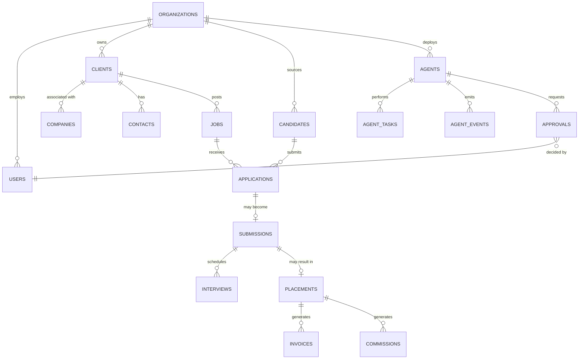

# Database Schema — Supabase/PostgreSQL (Design Target)

No database is connected in this starter — `services/*` are mock implementations. This document
describes the schema those services are designed to be swapped onto, using the entity names
requested for this MVP scaffold. It intentionally uses simpler table names
(`agents`, `agent_tasks`, `agent_events`, `approvals`) than the deeper architecture package in
[`/docs/architecture`](./architecture) — see the mapping note at the bottom for how the two relate;
they describe the same system at two levels of detail, not two different systems.

## Entity relationships

## Tables

**organizations** — tenant root. Every other table below (except global taxonomies, none of
which exist yet in this starter) carries `organization_id`.

**users** — platform users; `organization_memberships`-equivalent relationship to organizations
is via a join, not a foreign key on `users` itself, since a user is not owned by one org.

**clients** — customer staffing accounts. `status` (prospect/active/dormant/churned),
`account_owner_id -> users`.

**companies** — the company record a client is associated with (distinguished from `clients` so a
company can exist as a target account before it becomes a paying client — see
`docs/architecture/01-product-architecture.md`'s CRM domain).

**contacts** — individuals at a client. `client_id -> clients`, `is_primary`.

**jobs** — requisitions. `client_id -> clients`, `recruiter_owner_id -> users`, `status` lifecycle
enum, compensation range, `fee_percentage`.

**candidates** — people being recruited. `owner_id -> users`, `status` lifecycle enum,
`match_score` (nullable — populated once matched against a specific job).

**applications** — a candidate's progress against a specific job, pre-submission. `candidate_id`,
`job_id`, `stage` (sourced → contacted → responded → screened → qualified → …).

**submissions** — a candidate formally submitted to a client for a job. `application_id`,
`status` lifecycle enum, `ai_generated_draft` / `final_content` (provenance-separated, per
`docs/architecture/02-data-model.md`'s submissions table).

**interviews** — scheduled/completed interviews tied to a submission. `recommendation`
(advance/reject/hold).

**placements** — successful hires. `candidate_id`, `job_id`, `client_id`, `fee_amount`,
`status` (active/guarantee_period/confirmed/fell_through).

**invoices** — client billing tied to a placement. `amount`, `status`, `due_date`.

**commissions** — recruiter commission tied to a placement. `user_id`, `amount`, `status`.

**agents** — the agent registry. `department`, `role`, `status`, `autonomy_level` (0–5, see
`docs/AI_AGENT_ARCHITECTURE.md`), `permissions`, `tools`.

**agent_tasks** — individual units of work an agent performs. `agent_id`, `status`
(queued/in_progress/completed/failed/cancelled).

**agent_events** — the live activity feed. `agent_id`, `message`, `type`
(info/success/warning/action), `timestamp`.

**approvals** — the human approval gate. `agent_id`, `action`, `reason`, `risk_level`,
`status` (pending/approved/rejected), `decided_by -> users`.

## Tenant isolation & RLS

Every table above carries `organization_id` and is designed to be RLS-protected exactly as
specified in
[`docs/architecture/03-security-and-tenancy.md`](./architecture/03-security-and-tenancy.md) —
that document's two-layer isolation model (application-layer scoping + Postgres Row-Level
Security) applies unchanged to this schema. Nothing in this starter implements RLS yet, since
there is no database connection at all.

## Mapping to the deeper architecture package

This document uses the entity names requested for the MVP scaffold. The full architecture package
in [`/docs/architecture`](./architecture) and [`/docs/adr`](./adr) designs the same underlying
concepts with more granularity, under different names:

| This document | Architecture package equivalent |
|---|---|
| `agents` | `Agent` (config-as-code in `04-ai-and-agents.md#i-agent-registry`, not yet a table) |
| `agent_tasks` | `Task` with `created_by = 'AGENT'`, or a future dedicated `AgentRun` |
| `agent_events` | `events` (transactional outbox — `04-ai-and-agents.md#l-event-architecture`) |
| `approvals` | `approval_requests` (`04-ai-and-agents.md#k-human-approval-engine`) |
| `applications` | Not separately modeled in the architecture package — folded into `candidate_job_matches` + `submissions`; kept as a distinct stage here for the MVP scaffold's simpler funnel view |

When a real backend is built, follow the architecture package's schema
([`02-data-model.md`](./architecture/02-data-model.md)) as the authoritative source — it has the
full column list, indexes, constraints, and status enums this summary omits.

## Job Intelligence layer

The canonical Job Intelligence schema — `companies_intel`, `jobs`, `job_sources`,
`job_snapshots`, `job_signals`, `job_reposts`, `company_signals`, `job_watchlists`,
`job_watchlist_items`, `saved_job_searches` — lives in
[`supabase/migrations/0002_job_intelligence.sql`](../supabase/migrations/0002_job_intelligence.sql).
Its design and the scoring model are documented in
[`docs/JOB_INTELLIGENCE.md`](./JOB_INTELLIGENCE.md).

The central decision is **one universal `jobs` record** that many sources map onto (via
`job_sources`), rather than a `linkedin_jobs` / `indeed_jobs` / `workday_jobs` table per source.
The same opportunity seen on several boards and the employer's ATS collapses into one canonical
job; history accumulates in `job_snapshots` / `job_signals`, which is where the intelligence moat
starts.
